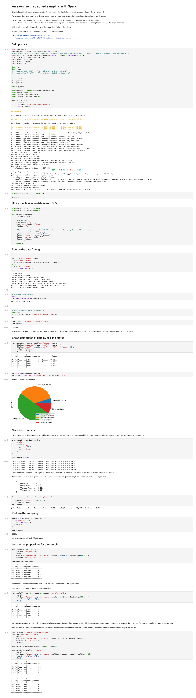

Data Processing Experiment - Part 16
---
- Sampling data to reduce the dataset size

---

> The code for this project is available in GitHub - I’m using a branch for each part and merging each part into the **[latest](https://github.com/prule/data-processing-experiment/tree/latest)** branch. See the ReadMe.md in each branch for the story.
>
> - [Github repository for this project](https://github.com/prule/data-processing-experiment/)
> - [Pull requests for each part](https://github.com/prule/data-processing-experiment/pulls?q=is%3Apr+is%3Aclosed)
> - [Branch for part-16](https://github.com/prule/data-processing-experiment/tree/part-16)

---

## Introduction

Stratified sampling is a way to reduce a dataset while keeping the distribution of certain characteristics similar to the original.

For example, if we have a very large dataset we may want to make it smaller to make processing and experimenting with it easier.

* We could take a random sample, but this will may mean the distribution of the data will not match the original.
    * Perhaps the original data was skewed toward a certain age group and gender in which case random sampling may change the shape of the data

With stratified sampling, the aim is to keep the proportions similar to the original.

The wikipedia page has a good example which I try to recreate below.

* https://en.wikipedia.org/wiki/Stratified_sampling
* https://spark.apache.org/docs/3.5.1/mllib-statistics.html#stratified-sampling

----

View this code as a notebook [here](https://colab.research.google.com/drive/1W1s9iJ37FxdowZNp2Qm6bxPHuw6XBsuK?usp=sharing).

----

## Details

Lets have a look at the raw data:
```
# Load the data
raw = load("file:/tmp/data/sample4/large/")
raw.count()

180,000


# Show distribution of data by sex and status
rawProportions = raw.groupBy("sex","status").count() \
.withColumn("proportion", col('count')/raw.count()) \
.withColumn("label", concat(col('sex'), lit("|"), col('status'))) \
.orderBy("sex","status")
rawProportions.show()

+------+---------+-----+----------+----------------+
|   sex|   status|count|proportion|           label|
+------+---------+-----+----------+----------------+
|Female|Full-time| 9000|      0.05|Female|Full-time|
|Female|Part-time|63000|      0.35|Female|Part-time|
|  Male|Full-time|90000|       0.5|  Male|Full-time|
|  Male|Part-time|18000|       0.1|  Male|Part-time|
+------+---------+-----+----------+----------------+
```
Graphing it as a pie chart might be a good way to visualise it - clicking the + next to the table lets you choose how to display the data shown.
```
values = rawProportions.toPandas()
values.plot(kind='pie', y='proportion', labels=values['label'])
```

### Transform the data

I'm not sure how to sample the data by multiple columns, so to make it simple I'll add a column which is the concatenation of sex and status. Then I can just sample by that column.

```
transformed = raw.withColumn( \
  'sample_by', \
  concat( \
    col("sex"), \
    lit("|"), \
    col("status") \
  ) \
)
```

### Calculate how to scale each stratum

If we have 180 rows and we want to reduce that to 40 we need to sample 40/180 = approx 22%.

And we want to take equal proportions of each segment (in this example) so the sample proportions will match the original data.

```
fractions = transformed.select("sample_by") \
.distinct() \
.withColumn("fraction", lit(.22)) \
.rdd.collectAsMap()
```
results in

```
{
'Male|Full-time':0.22,
'Male|Part-time':0.22,
'Female|Full-time':0.22,
'Female|Part-time':0.22
}
```
Perform the sampling

```
sample = transformed.stat.sampleBy( \
col="sample_by", \
fractions=fractions, \
seed=12 \
)

sample.count()

39631
```
We have approximately 40,000 rows in our sample.

Look at the proportions for the sample

```
sampledProportions = sample \
.groupBy("sex","status") \
.count() \
.withColumn("proportion", (col('count')/sample.count()).cast(DecimalType(10,2))) \
.orderBy("sex","status")


+------+---------+-----+----------+
|   sex|   status|count|proportion|
+------+---------+-----+----------+
|Female|Full-time| 1907|      0.05|
|Female|Part-time|13904|      0.35|
|  Male|Full-time|19911|      0.50|
|  Male|Part-time| 3909|      0.10|
+------+---------+-----+----------+
```
From the wikipedia page, I expected:

* 5% (2 individuals) should be female, full-time.
* 35% (14 individuals) should be female, part-time.
* 50% (20 individuals) should be male, full-time.
* 10% (4 individuals) should be male, part-time.

So this is spot on! We have the same proportions across the combinations of sex and status but a much smaller dataset at 40,000 rows instead of 180,000.

But wait, with simple random sampling I get the same result:

```
raw.sample(fraction=0.22, seed=12).groupBy("sex","status") \
  .count() \
  .withColumn("proportion", (col('count')/sample.count()).cast(DecimalType(10,2))) \
  .orderBy("sex","status") \
  .show()

+------+---------+-----+----------+
|   sex|   status|count|proportion|
+------+---------+-----+----------+
|Female|Full-time| 1907|      0.05|
|Female|Part-time|13904|      0.35|
|  Male|Full-time|19911|      0.50|
|  Male|Part-time| 3909|      0.10|
+------+---------+-----+----------+
```
It's exactly the same! No point in all that complexity in this example. Perhaps if we wanted to CHANGE the proportions (use unequal fractions) then we could do it that way. (Perhaps for manufacturing some sample data?)

----

If we use a small dataset we can see the proportions are close to expected but not quite exact - that is, the bigger the dataset the more accurate the proportions will be.

```
small = load("file:/tmp/data/sample4/small/")
small.groupBy("sex","status") \
  .count() \
  .withColumn("proportion", (col('count')/small.count()).cast(DecimalType(10,2))) \
  .orderBy("sex","status") \
  .show()

+------+---------+-----+----------+
|   sex|   status|count|proportion|
+------+---------+-----+----------+
|Female|Full-time|    9|      0.05|
|Female|Part-time|   63|      0.35|
|  Male|Full-time|   90|      0.50|
|  Male|Part-time|   18|      0.10|
+------+---------+-----+----------+


smallSample = small.sample(fraction=0.22, seed=12)

smallSample.groupBy("sex","status") \
  .count() \
  .withColumn("proportion", (col('count')/smallSample.count()).cast(DecimalType(10,2))) \
  .orderBy("sex","status") \
  .show()

+------+---------+-----+----------+
|   sex|   status|count|proportion|
+------+---------+-----+----------+
|Female|Full-time|    1|      0.02|
|Female|Part-time|   14|      0.32|
|  Male|Full-time|   24|      0.55|
|  Male|Part-time|    5|      0.11|
+------+---------+-----+----------+
```
Close, but not as close as when the dataset was bigger.

---

[Notebook](notebooks/part-16-colab-stratified-sampling/Stratified_sampling_with_spark.ipynb)


