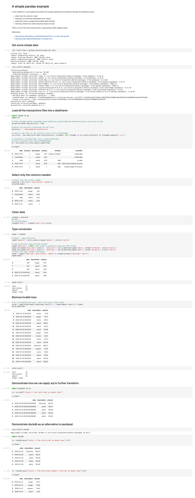

Data Processing Experiment - Part 13
---
- The one where I try out using Pandas to manipulate data

---

> The code for this project is available in GitHub - I’m using a branch for each part and merging each part into the **[latest](https://github.com/prule/data-processing-experiment/tree/latest)** branch. See the ReadMe.md in each branch for the story.
>
> - [Github repository](https://github.com/prule/data-processing-experiment/)
> - [Pull requests for each part](https://github.com/prule/data-processing-experiment/pulls?q=is%3Apr+is%3Aclosed)
> - [Branch for latest](https://github.com/prule/data-processing-experiment/tree/latest)

---

## Introduction

After using colab notebooks, I thought it was time to have a look at using more native Python options like [Pandas](https://www.codecademy.com/article/introduction-to-numpy-and-pandas).

## Details

In this episode, I'm just using Python with Pandas to manipulate dataframes to process data.

I've created a git repository with just data - so the first thing to do is clone this repo so it's local:
```
!git clone https://github.com/prule/data.git data
```

Because there are multiple files in the transactions directory, I want to load them all into one dataframe:
```
import pandas as pd
import os

# https://pandas.pydata.org/pandas-docs/stable/user_guide/indexing.html#returning-a-view-versus-a-copy
pd.options.mode.copy_on_write = True

directory = './data/sample1/transactions'

# Load all CSV files in the directory into a list of DataFrames
csv_files = [pd.read_csv(os.path.join(directory, filename)) for filename in os.listdir(directory) if filename.endswith('.csv')]

# Concatenate the DataFrames into a single DataFrame
# https://stackoverflow.com/a/47576083/20242
df = pd.concat(csv_files,ignore_index=True)
```

With the raw dataframe constructed, I want to select only the columns of interest
```
# select only the columns needed
selected = df[['date','description','amount']]
selected.head()
```

Data cleaning comes next - I know the date column has superflous spaces which break parsing so I need to trim these
```
cleaned = selected
## date
# trim whitespace
cleaned['date'] = cleaned['date'].str.strip()
```

To do type conversion is a bit more complicated. Amount is simple, but for date I need to support multiple date formats so I'll add a column and iteratively
update this column by using each date format.

Once complete I need to select the desired columns (with my new date column) and alias the column names so they are back to normal.
```
typed = cleaned

# amount - type conversion
typed['amount'] = pd.to_numeric(typed['amount'], errors='coerce')

# type conversion using multiple formats
typed['date_new'] = None # add column to populate using each date format
typed.loc[typed['date_new'].isnull(), 'date_new'] = pd.to_datetime(typed['date'], format='%Y-%m-%d', errors='coerce')
typed.loc[typed['date_new'].isnull(), 'date_new'] = pd.to_datetime(typed['date'], format='%d-%m-%Y', errors='coerce')
# select the right columns (aliasing)
typed = typed[['date_new','description','amount']].rename(columns={'date_new':'date'})
```

And then it's just a matter of dropping the invalid rows

```
valid = typed.drop(typed[(typed.date.isnull()) | (typed.amount.isnull())].index)
```

At this point so far, this hasn't seemed intuitive. Lots to learn about pandas and the errors aren't very descriptive.
There are some options to use a more SQL like approach.

Firstly with [pandasql](https://pypi.org/project/pandasql/):
```
import pandasql as ps
rs = ps.sqldf("select * from valid order by amount desc")
```

And alternatively with [duckdb](https://duckdb.org/2021/05/14/sql-on-pandas.html):
```
import duckdb
# order by
rs = duckdb.query("select * from valid order by amount desc").df()
# order by with where clause
rs = duckdb.query("select * from valid where amount < 20 order by amount desc").df()
```

## Summary

Pandas is a Python library used for data manipulation and analysis. It offers data structures and operations for manipulating numerical tables and time series. Pandas is built on top of the NumPy library and provides a high-performance, easy-to-use interface for data analysis tasks.

I've covered some basic uses cases here - showing how notebooks with pandas can be used to manipulate data.

I've exported the notebook from colab as a `ipynb` file, so I can convert it to html:

```commandline
pip install jupyter 
jupyter nbconvert --to html Pandas_example.ipynb
```

And now, as a simple HTML file it can easily be captured as a screenshot using the web developer tools available in [Chrome](https://www.tomsguide.com/how-to/how-to-screenshot-a-full-page-in-chrome), [Safari](https://eshop.macsales.com/blog/76508-take-a-screenshot-of-an-entire-webpage/), and [Firefox](https://support.mozilla.org/en-US/kb/take-screenshots-firefox).

