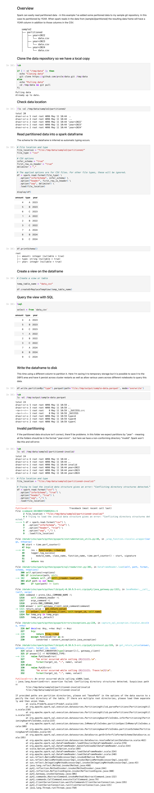

Data Processing Experiment - Part 14
---
- The one where I use a databricks notebook with spark and partitioned data.

---

> The code for this project is available in GitHub - I’m using a branch for each part and merging each part into the **[latest](https://github.com/prule/data-processing-experiment/tree/latest)** branch. See the ReadMe.md in each branch for the story.
>
> - [Github repository for this project](https://github.com/prule/data-processing-experiment/)
> - [Pull requests for each part](https://github.com/prule/data-processing-experiment/pulls?q=is%3Apr+is%3Aclosed)
> - [Branch for part-14](https://github.com/prule/data-processing-experiment/tree/part-14)

---

## Introduction

Today's exercise is using a DataBricks notebook to play with spark dataframes using partitioning - with big data this is useful to parallelize processing across a spark cluster. 

- https://spark.apache.org/docs/latest/sql-data-sources-parquet.html
- https://medium.com/@dipayandev/everything-you-need-to-understand-data-partitioning-in-spark-487d4be63b9c
- https://statusneo.com/everything-you-need-to-understand-data-partitioning-in-spark/#:~:text=Spark%2FPyspark%20partitioning%20is%20a,faster%20reads%20by%20downstream%20systems.

A screen shot of the full notebook can be seen at the end of this article.

## Details

I have a little git repository with some simple sample data. I clone this so I have a local copy:
```
git clone https://github.com/prule/data.git /tmp/data
```
which looks like this:
```
sample2
├── partitioned
│   ├── year=2022
│   │   └── data.csv
│   ├── year=2023
│   │   └── data.csv
│   └── year=2024
│       └── data.csv
```
The year value isn't in the CSV files, but is provided by the directory name. When the dataframe is loaded the year value will be a column.

>  In a partitioned table, data are usually stored in different directories, with partitioning column values encoded in the path of each partition directory. All built-in file sources (including Text/CSV/JSON/ORC/Parquet) are able to discover and infer partitioning information automatically.

Now load it into a spark dataframe: 
```
df = spark.read.format(file_type) \
  .option("inferSchema", infer_schema) \
  .option("header", first_row_is_header) \
  .option("sep", delimiter) \
  .load(file_location)
```
The schema is inferred so columns are typed appropriately:
```
root
 |-- amount: integer (nullable = true)
 |-- type: string (nullable = true)
 |-- year: integer (nullable = true)
 ```
There's lots that can be done with the dataframe to transform the data now, but that's for another time. 

Next though is to create a view from the dataframe:
```
df.createOrReplaceTempView("data_csv")
```
which we can then query with SQL:
```
%sql
select * from `data_csv`
```
Also, the dataframe can be written to disk, in this case partitioned by type instead of date (just as a example):
```
df.write.partitionBy("type").parquet(path='file:/tmp/output/sample-data.parquet', mode='overwrite')
```
Which produces
```
sample-data.parquet
├── type=A
├── type=B
├── type=C
```

----

Note that if your data isn't properly partitioned on disk the dataframe will fail to load.

So in this case it will fail since the "invalid" directory doesn't follow the expected "year=nnnn" format:
```
└── partitioned-invalid
    ├── invalid
    │   └── data.csv
    ├── year=2022
    │   └── data.csv
    ├── year=2023
    │   └── data.csv
    └── year=2024
        └── data.csv
```

## Summary

Spark partitioning is a technique used to distribute data across multiple nodes in a Spark cluster. It enables parallel processing and improves performance by allowing multiple tasks to work on different partitions of the data simultaneously.

Here I've loaded some partitioned data into a spark dataframe, demonstrated how it can be queried or transformed and then persisted to disk.

---

I've exported the notebook as a `ipynb` file, so I can convert it to html:

```commandline
pip install jupyter 
jupyter nbconvert --to html Spark\ Partitioned\ Example.ipynb
```

And now, as a simple HTML file it can easily be captured as a screenshot using the web developer tools available in [Chrome](https://www.tomsguide.com/how-to/how-to-screenshot-a-full-page-in-chrome), [Safari](https://eshop.macsales.com/blog/76508-take-a-screenshot-of-an-entire-webpage/), and [Firefox](https://support.mozilla.org/en-US/kb/take-screenshots-firefox).


