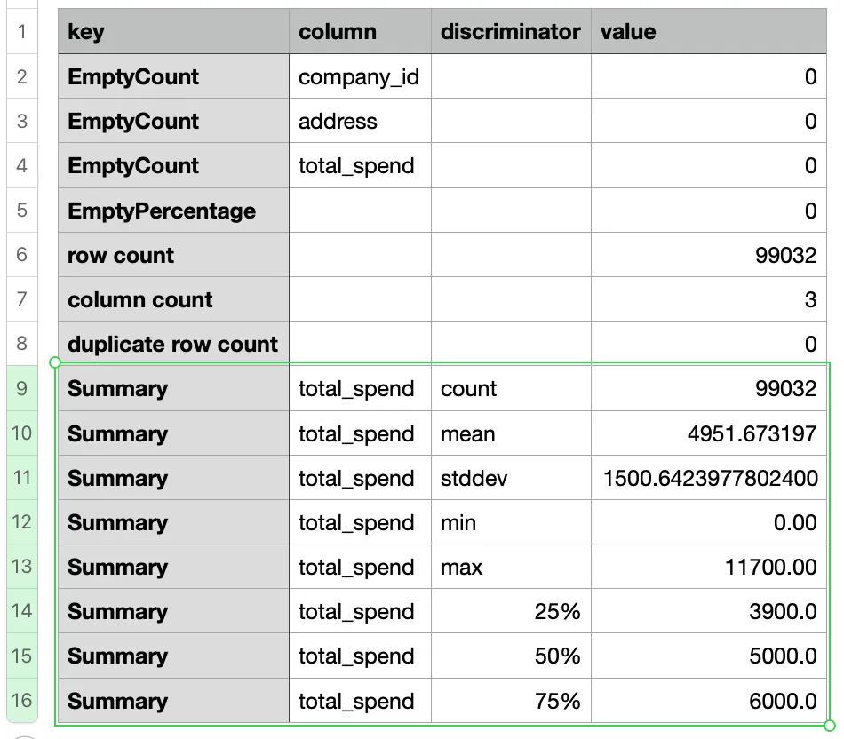
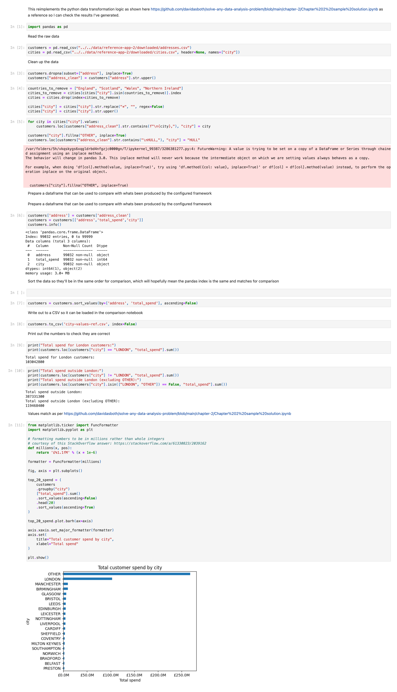
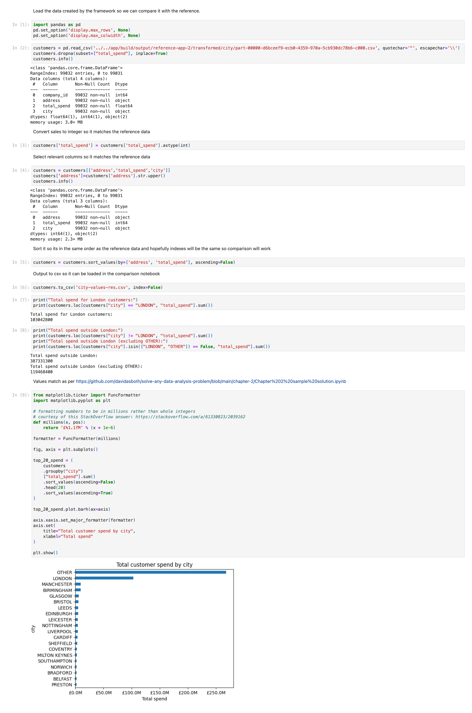
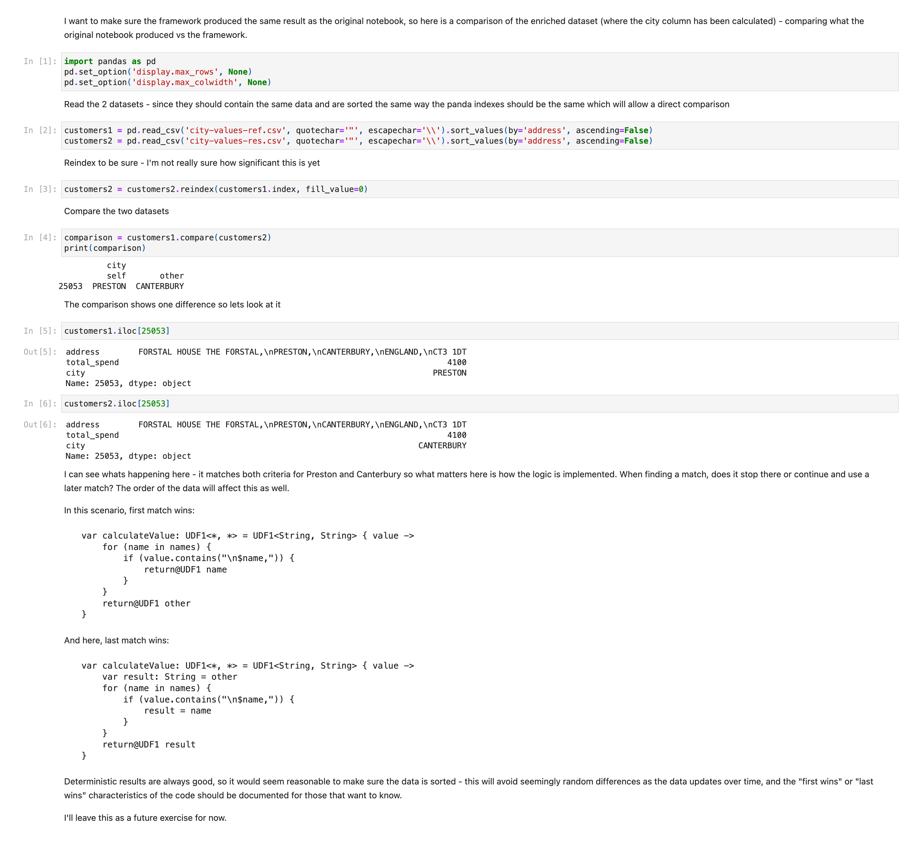
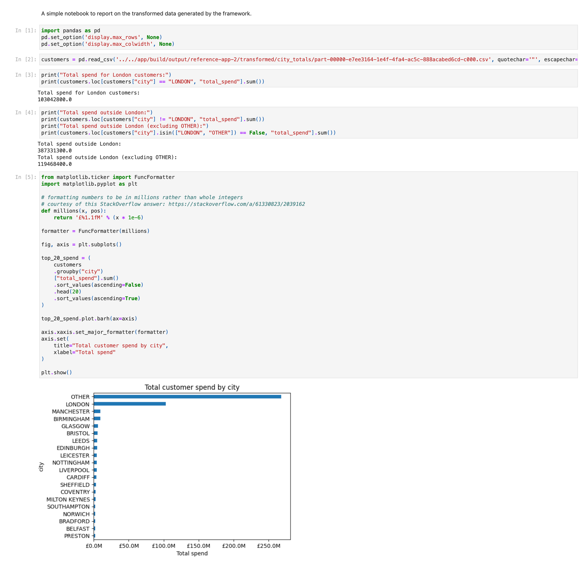

Data processing experiment - Part 17
---
Applying the framework to real world examples

> The code for this project is available in GitHub - I’m using a branch for each part and merging each part into the **[latest](https://github.com/prule/data-processing-experiment/tree/latest)** branch. See the ReadMe.md in each branch for the story.
>
> - [Github repository for this project](https://github.com/prule/data-processing-experiment/)
> - [Pull requests for each part](https://github.com/prule/data-processing-experiment/pulls?q=is%3Apr+is%3Aclosed)
> - [Branch for part-17](https://github.com/prule/data-processing-experiment/tree/part-17)

## Introduction

At the moment I’m reading “[Solve any data analysis problem](https://www.manning.com/books/solve-any-data-analysis-problem)” - so I think I’ll try to apply the use case presented in chapter 2 to my framework to see how it measures up.

The imaginary scenario here is that we could use the notebook to investigate the data and discover WHAT we need to do, and then we could configure an automated pipeline to implement this…

- an assumption here would be that the data would be refreshed regularly
- so we use a notebook to first look at the data and understand it
  - figure out how we need to transform the data
- then configure the framework to do the transformation
  - run this when new data arrives to produce an aggregated summary in CSV (or similar) format
- and then use a notebook (or any other reporting tool) to display the result

In this case, we need to process some data to compute the CITY for a table of sales data. Then we need to sum the total sales by city. From that we’ll know how much sales in London vs outside London.

Now lets download some data:

```
./run data:download:reference-app-2
```
which will give us our data:
```
./data/reference-app-2
├── downloaded
│   ├── addresses.csv
│   └── cities.csv
```

Configuration of the framework consists of:

- [./data/reference-app-2/tables.json5](https://github.com/prule/data-processing-experiment/blob/part-17/data/part17/part17.tables.json5) to define sources, options, tables and columns.
  - the customers table will have “address” as a required field so automatically empty values will be removed from the valid data frame.
- [./data/reference-app-2/statistics.json5](https://github.com/prule/data-processing-experiment/blob/part-17/data/part17/part17.statistics.json5) to define statistics for each table.
  - this will give us useful statistics which we can check against the published problem to make sure data is tracking correctly
- [./data/reference-app-2/pipeline.json5](https://github.com/prule/data-processing-experiment/blob/part-17/data/part17/part17.pipeline.json5) is required to perform a series of steps to transform the data and build the DataFrames needed to answer the business question.

For the pipeline, there’s a series of steps:

- ValuesFilterProcessor is used to exclude some values that have been determined to be excluded from the cities values: ["England", "Scotland", "Wales", "Northern Ireland"].

```
{
    type: "com.example.dataprocessingexperiment.spark.pipeline.ValuesFilterProcessor",
    id: "city.1",
    name: "Value filter",
    description: "Remove rows where values match those specified",
    table: "cities",
    column: "city",
    values: ["England", "Scotland", "Wales", "Northern Ireland"],
    exclude: true
}
```
- RegExReplaceProcessor is used to remove ‘*’ from the city name
```
{
    type: "com.example.dataprocessingexperiment.spark.pipeline.RegExReplaceProcessor",
    id: "city.2",
    name: "Reg ex replace filter",
    description: "Remove * from city names",
    table: "cities",
    column: "city",
    regex: "[*#@]",
    replacement: "",
}
```
- ValueContainsOneInListProcessor lets us add a column “city” to the customers table with the value derived from a list (from the column in the dimension table)
  - select the “city” column from the cities table to produce a list of values
  - for each row in the customers table
    - iterate over each “city” value, and if this is contained in the customers address field, use this for the city value in the customers table
```
{
    type: "com.example.dataprocessingexperiment.app.part17.ValueContainsOneInListProcessor",
    id: "customers.3",
    name: "City Name",
    description: "Derive city name from address",
    factTable: "customers",
    factCol: "address",
    dimensionTable: "cities",
    dimensionCol: "city",
    other: "OTHER"
}
```
- CityProcessor implements logic to fix the “Hull” use case
```
{
    type: "com.example.dataprocessingexperiment.app.part17.CityProcessor",
    id: "customers.3a",
    name: "City Name",
    description: "Handle HULL special case",
    factTable: "customers",
    targetDimension: "city",
    sourceDimension: "address",
}
```
- Output the result of enriching the customer data with the calculated city - for debugging/visibility purposes - this could be commented out or removed when we no longer need it
```
{
    type: "com.example.dataprocessingexperiment.spark.pipeline.OutputProcessor",
    id: "customers.city.output",
    name: "Output customers with city",
    description: "Writes out the enriched customers",
    table: "customers",
    path: "./build/output/reference-app-2/transformed/city",
    format: "csv",
    mode: "overwrite",
    options: {
        "header": "true",
    }
}
```
- AggregateSumProcessor is used to sum the total by city
```
{
    type: "com.example.dataprocessingexperiment.spark.pipeline.AggregateSumProcessor",
    id: "customers.4",
    name: "City total",
    description: "Sum by city",
    table: "customers",
    sumColumn: "total_spend",
    groupColumn: "city",
    resultTable: "city_totals",
}
```
- Output the aggregated data as the result
```
{
    type: "com.example.dataprocessingexperiment.spark.pipeline.OutputProcessor",
    id: "customers.output",
    name: "Output transformed customers",
    description: "Writes out the enriched customers",
    table: "city_totals",
    path: "./build/output/reference-app-2/transformed/city_totals",
    format: "csv",
    mode: "overwrite",
    options: {
        "header": "true",
    }
}
```

As part of cleaning up and standardising, I’m referring to the application for this part as “reference-app-2” (reference-app-1 being the original application used in previous parts)

Run the framework with
```
./run run:2
```
Output will be produced in
```
./app/build/output/reference-app-2
```
I’ve put a copy of the log output [here](https://github.com/prule/data-processing-experiment/blob/part-17/data/reference-app-2/logs/part-17-console-output.txt) for reference.

> Maintaining good log output is a simple way to get a feel for how things are going. It’s worth putting some thought and effort into so you get a good result. Too much noise isn’t great, too little and you won’t know what’s going on. With the reference applications I have a good way to exercise the framework, and the logs give me a convenient way to review progress.

After running this, I can start comparing the results with that in the published notebook here https://github.com/davidasboth/solve-any-data-analysis-problem/blob/main/chapter-2/Chapter%202%20sample%20solution.ipynb

Statistics for the customers table matches
- see CSV in app/build/output/reference-app-2/statistics/customers/valid/
- Rows with empty address have been removed - leaving 99,032 rows

- The desired aggregated data has been written as well as intermediate enriched data (addresses with the calculated cities)
    - app/build/output/reference-app-2/transformed/city_totals
        - this is the aggregated data.
    - app/build/output/reference-app-2/transformed/city
      - this is the intermediate enriched data used to generate the aggregated result.
      
  - We can use a notebook to query this data to answer the business questions
    - First, a [notebook](https://github.com/prule/data-processing-experiment/blob/part-17/notebooks/part17/city-reference-setup.ipynb) to recreate the transformations and answers so I can verify I’ve got the right data and have the answers. Also output the full enriched dataset so I can do a comparison with what I calculate with my framework.
    - Second, a [notebook](https://github.com/prule/data-processing-experiment/blob/part-17/notebooks/part17/city-result-setup.ipynb) to take the enriched data output by the framework to check the numbers and output the data in a standard format so I can compare it with the output from the first notebook and find any differences.
    - Third, a [notebook](https://github.com/prule/data-processing-experiment/blob/part-17/notebooks/part17/city-compare.ipynb) to compare the outputs from the first and second notebook so I can see if there is any difference between the implementations.
      - This shows one difference: In one row, the address matches both criteria for Preston and Canterbury so what matters here is how the logic is implemented. When finding a match, does it stop there or continue and use a later match? The order of the data will affect this as well.
    - Fourth, a [notebook](https://github.com/prule/data-processing-experiment/blob/part-17/notebooks/part17/city-report.ipynb) that uses the transformed data (total spend aggregated by city) to produce a report to answer the business questions:
      - “understand the spending of London customers vs. those outside London”
      
To create the pipeline I’ve had to implement a couple of new processors - I’ve made these generic where possible, but it’s completely acceptable to have some custom logic for a specific problem too - the framework doesn’t prevent you from doing that so you have complete freedom.

In this change I’ve also done some cleaning up, refactoring, standardisation and gradle dependency simplification… so it’s a pretty big [pull request](https://github.com/prule/data-processing-experiment/pull/18). There’s more I’d like to do, but I’m out of time!

Summary
---

- JSON configuration defines tables according to the CSV data provided
  - table configuration indicates which columns are required vs optional and their types
    - so invalid rows are automatically removed
    - automatic generation of statistics allows visibility of these particulars
- JSON configuration defines statistics to generate automatically for each table at each stage (raw, valid, transformed)
  - allows for visibility of the data at each stage
- JSON configuration defines a series of tasks to perform on the data
  - most of these tasks are generic and could be applied to many use-cases
  - some of these tasks might be specific to the problem at hand
- Running the application with these configurations produces output in line with what was expected


Here’s screenshots of the four notebooks for reference:

[./notebooks/part17/city-reference-setup.ipynb](./notebooks/part17/city-reference-setup.ipynb)


[./notebooks/part17/city-result-setup.ipynb](./notebooks/part17/city-result-setup.ipynb)


[./notebooks/part17/city-compare.ipynb](./notebooks/part17/city-compare.ipynb)


[./notebooks/part17/city-report.ipynb](./notebooks/part17/city-report.ipynb)

