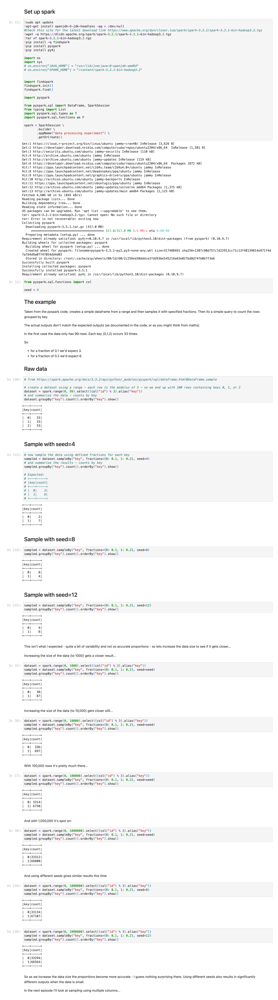

Data Processing Experiment - Part 15
---
- Experimenting with sampling and seeing the effect of data size.

---

> The code for this project is available in GitHub - I’m using a branch for each part and merging each part into the **[latest](https://github.com/prule/data-processing-experiment/tree/latest)** branch. See the ReadMe.md in each branch for the story.
>
> - [Github repository for this project](https://github.com/prule/data-processing-experiment/)
> - [Pull requests for each part](https://github.com/prule/data-processing-experiment/pulls?q=is%3Apr+is%3Aclosed)
> - [Branch for part-15](https://github.com/prule/data-processing-experiment/tree/part-15)

---

## Introduction

sampleBy() is a method in Apache Spark that allows you to perform stratified sampling on a DataFrame or RDD.

Stratified sampling means dividing the data into distinct subgroups (strata) and then sampling each subgroup independently according to specified fractions. This is particularly useful when you want to ensure that certain subsets of your data are well-represented in the sample.

A screen shot of the full notebook can be seen at the end of this article.

Use Cases:

* Balanced Datasets: Ensure that each subgroup of data is equally represented in the sample, useful in machine learning for training balanced models.
* Data Analysis: Analyze a representative subset of data from each category without processing the entire dataset.
* Quality Assurance: Validate the integrity of data processing steps on stratified samples.

The pyspark source has an example demonstrating how to use it [here](https://spark.apache.org/docs/3.3.2/api/python/_modules/pyspark/sql/dataframe.html#DataFrame.sample).

----

View this code as a notebook [here](https://colab.research.google.com/drive/1SByfibzSjAcq0V9kow5hM0x6IUpEnoae?usp=sharing).

----

## Details

First, we need some data:
```
# create a dataset using a range - each row is the modulus of 3
#  - so we end up with 100 rows containing keys 0, 1, or 2
dataset = spark.range(0, 99).select((col("id") % 3).alias("key"))

# and summarise the data - counts by key
dataset.groupBy("key").count().orderBy("key").show()

+---+-----+
|key|count|
+---+-----+
|  0|   33|
|  1|   33|
|  2|   33|
+---+-----+
```
When taking a sample we need to specify the column to use - in this case `key` and then the fraction of those matching rows we want - so in this case we are using fractions:
```
{
    0: 0.1,
    1: 0.2
}
```
In this case the raw data only has 99 rows. Each key (0,1,2) occurs 33 times.

So

* for a fraction of 0.1 we'd expect 3.
* for a fraction of 0.2 we'd expect 6.
* if a fraction isn’t specified for a key we expect 0.

* Now lets do some sampling:
```
# now sample the data using defined fractions for each key
sampled = dataset.sampleBy("key", fractions={0: 0.1, 1: 0.2}, seed=4)
# and summarise the results - counts by key
sampled.groupBy("key").count().orderBy("key").show()

# Expected:
# +---+-----+
# |key|count|
# +---+-----+
# |  0|    3|
# |  1|    6|
# +---+-----+

# Actual
+---+-----+
|key|count|
+---+-----+
|  0|    6|
|  1|   12|
+---+-----+
```
This isn’t quite the result I was expecting…

For comparison lets try different seed values

* For seed = 8 I get
```
+---+-----+
|key|count|
+---+-----+
|  0|    8|
|  1|    4|
+---+-----+
```
* For see 12 I get
```
+---+-----+
|key|count|
+---+-----+
|  0|    4|
|  1|    8|
+---+-----+
```
Quite a bit of variability and not so accurate proportions - so lets increase the data size to see if it gets closer...
```
# use the dataSize variable to change the range

dataset = spark.range(0, dataSize).select((col("id") % 3).alias("key"))
sampled = dataset.sampleBy("key", fractions={0: 0.1, 1: 0.2}, seed=seed)
sampled.groupBy("key").count().orderBy("key").show()
```

dataSize = 1000:
```
+---+-----+
|key|count|
+---+-----+
|  0|   38|
|  1|   87|
+---+-----+
```
Data size = 10,000:
```
+---+-----+
|key|count|
+---+-----+
|  0|  336|
|  1|  697|
+---+-----+
```
Data size = 100,000
```
+---+-----+
|key|count|
+---+-----+
|  0| 3314|
|  1| 6750|
+---+-----+
```
Data size = 1,000,000
```
+---+-----+
|key|count|
+---+-----+
|  0|33312|
|  1|66800|
+---+-----+
```
Now it looks pretty accurate.

For interest sake, lets try different seeds again…

For seed = 8:

```
dataset = spark.range(0, 1000000).select((col("id") % 3).alias("key"))
sampled = dataset.sampleBy("key", fractions={0: 0.1, 1: 0.2}, seed=8)
sampled.groupBy("key").count().orderBy("key").show()

+---+-----+
|key|count|
+---+-----+
|  0|33134|
|  1|67107|
+---+-----+
```
For seed = 12:

```
dataset = spark.range(0, 1000000).select((col("id") % 3).alias("key"))
sampled = dataset.sampleBy("key", fractions={0: 0.1, 1: 0.2}, seed=12)
sampled.groupBy("key").count().orderBy("key").show()

+---+-----+
|key|count|
+---+-----+
|  0|33294|
|  1|66564|
+---+-----+
```
As we might expect, the seed does not make any significant difference with a large enough dataset…

## Summary

In summary, if you are using sampling and wanting an accurate proportion of data, make sure you have a big enough dataset.

while developing something new, I’ll use a tiny dataset to iterate quickly - but in this case it threw me off when I didn’t see what I expected.

---

[Notebook](notebooks/part-15-colab-sampling-1/Sampling_data_with_spark.ipynb)


