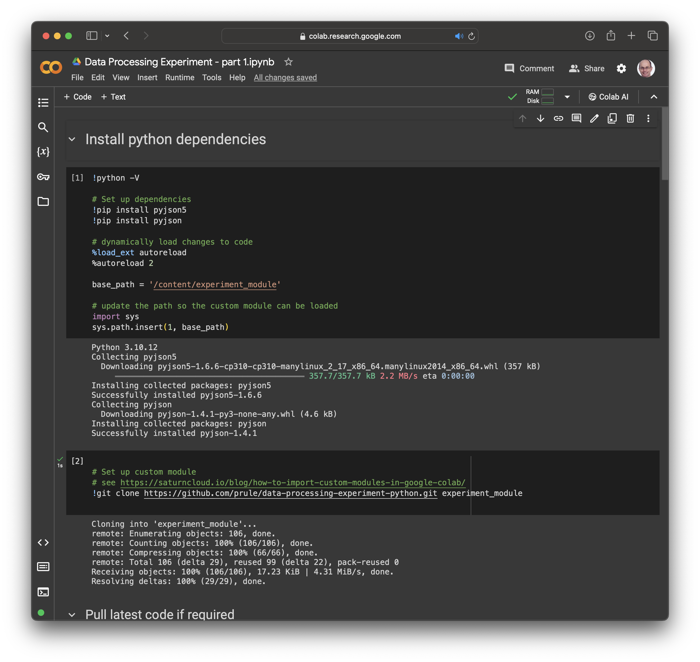
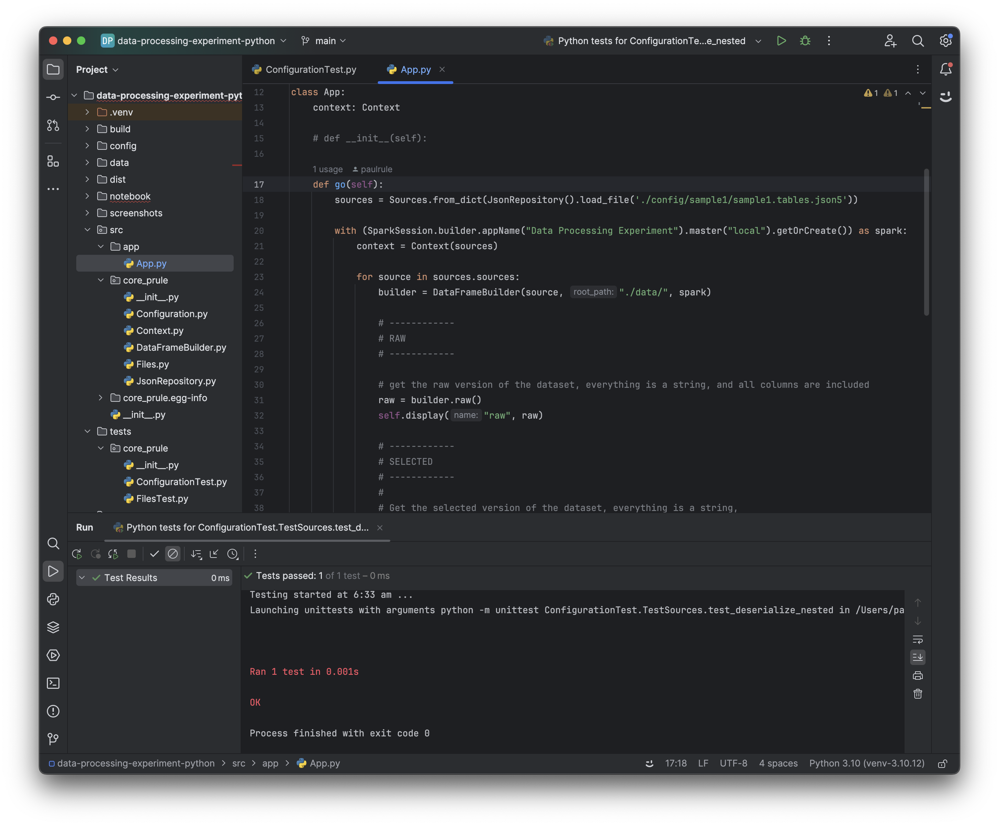
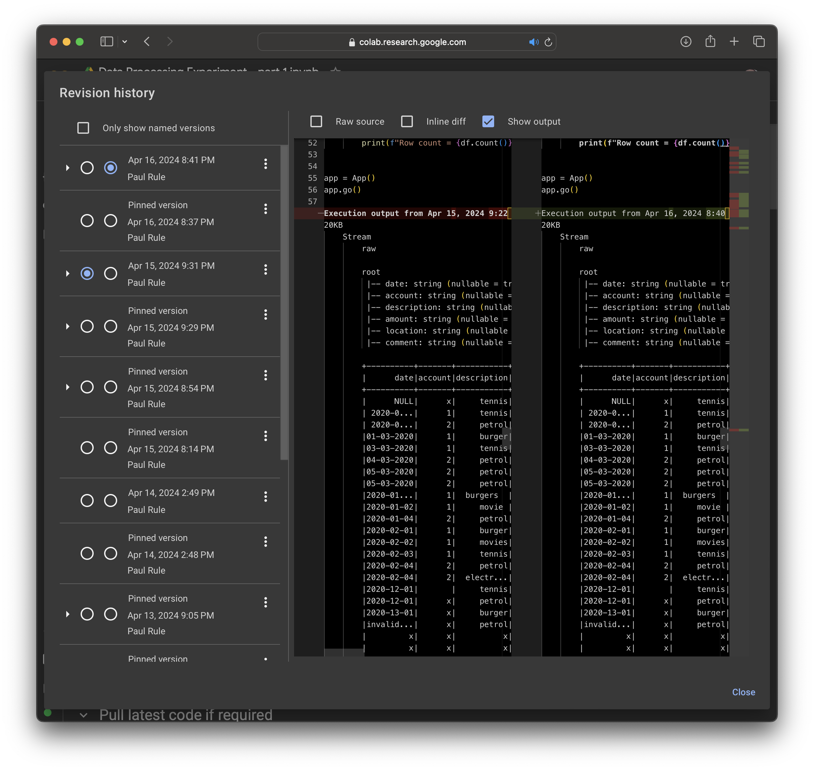

Data Processing Experiment - Part 12
---
- The one where I try out Google Colab notebooks to do something similar to the Kotlin codebase.

---

> The code for the Python project is available in GitHub
> - [Github repository](https://github.com/prule/data-processing-experiment-python/)
>
> The code for the Kotlin project is available in GitHub - I’m using a branch for each part and merging each part into the **[latest](https://github.com/prule/data-processing-experiment/tree/latest)** branch. See the ReadMe.md in each branch for the story.
>
> Kotlin Project
> - [Github repository](https://github.com/prule/data-processing-experiment/)
> - [Pull requests for each part](https://github.com/prule/data-processing-experiment/pulls?q=is%3Apr+is%3Aclosed)
> - [Branch for latest](https://github.com/prule/data-processing-experiment/tree/latest)

---

## Introduction

After playing with [DataBricks](https://databricks.com) notebooks, I thought I'd play with [Google Colab](https://colab.research.google.com) notebooks. This time I want to see if I can develop the python code as a module, and then use that from the notebook.



## Details

I'm using [PyCharm](https://www.jetbrains.com/pycharm/) to develop the python code - this gives me a familiar environment to code, test, and execute. I'm not used to python so I'm using a free version of [Cody](https://sourcegraph.com/demo/cody) AI assistant with the [Intellij plugin](https://plugins.jetbrains.com/plugin/9682-cody-ai-coding-assistant-with-autocomplete--chat) to help me with the syntax.


The python code can be developed in a similar way to the Kotlin code - some of the classes are similar, and its a lot easier to code and test in an IDE versus the notebook. I've taken the code only as far as loading the raw, selected, typed dataframes - not as complete as Kotlin version because the rest is purely academic. The interesting part is seeing how all of this fits together and how it works.
See
- https://github.com/prule/data-processing-experiment-python/blob/main/src/app/App.py
- https://github.com/prule/data-processing-experiment-python/blob/main/src/core_prule/DataFrameBuilder.py

To make the python module available to the notebook I've cloned the git repository and added it to the path:
```notebook
!git clone https://github.com/prule/data-processing-experiment-python.git experiment_module
```

In order for the notebook python to find the module, I need to add the path to the python module to the system path:
```python
base_path = '/content/experiment_module'

# update the path so the custom module can be loaded
import sys
sys.path.insert(1, base_path)
```

As I make changes to the code and push them to github, I want to load those changes into the notebook. Git PULL will pull in the changes:
```notebook
!cd experiment_module && git pull
```

And so these changes will be dynamically reloaded I had to add:
```notebook
# dynamically load changes to code
%load_ext autoreload
%autoreload 2
```

The python module lets me load the configuration and then process it to create the dataframes. So from the notebook I can start to reproduce the reference application:
```python
sources = Sources.from_dict(JsonRepository().load_file(base_path + '/config/sample1/sample1.tables.json5'))

with (SparkSession.builder.appName("Data Processing Experiment").master("local").getOrCreate()) as spark:
    context = Context(sources)

    for source in sources.sources:
        builder = DataFrameBuilder(source, base_path + "/data/", spark)

        typed = builder.typed()
        self.display("typed", typed)

        # Add to context
        context.put(source.key, typed)
...
```

## Summary

This episode has been a bit rushed, but we've seen how the python code can be developed in an IDE, and then loaded into the notebook. This would allow a team to leverage simple externalised configuration and functionality to drive the data processing as was done in the Kotlin project. The intention here would be to be able to provide consistency across this work as well as speeding up the process.

## Other interesting points

Colab keeps version history, and its easy to browse the history and compare any two versions.



The notebook can also be exported as an `ipynb` file - which includes the source and the output. This file can be opened in Intellij with the Jupyter
plugin.

It can also be converted to HTML using the following:
```commandline
pip install jupyter 
jupyter nbconvert --to html Data_Processing_Experiment_part_12.ipynb
```

And now, as a simple HTML file it can easily be captured as a screenshot using the web developer tools available in Chrome, Safari, and Firefox.

