Data Processing Experiment - Part 11
---
- The one where I try out DataBricks Community Edition to do something similar to the Kotlin codebase. 

---

> The code for this project is available in GitHub - I’m using a branch for each part and merging each part into the **[latest](https://github.com/prule/data-processing-experiment/tree/latest)** branch. See the ReadMe.md in each branch for the story.
>
> - [Github repository for this project](https://github.com/prule/data-processing-experiment/)
> - [Pull requests for each part](https://github.com/prule/data-processing-experiment/pulls?q=is%3Apr+is%3Aclosed) 
> - [Branch for part-11](https://github.com/prule/data-processing-experiment/tree/part-11)

---

To get started with DataBricks I signed up to the [community edition](https://docs.databricks.com/en/getting-started/community-edition.html). This has some limitations but it'll suit me for this experiment. I've exported the source to [notebooks/databricks/Data processing experiment 1.py](notebooks/databricks/Data processing experiment 1.py)

First step is to upload the data I want to use - this is done via the Catalog menu, uploading to DBFS, so we have a directory structure like:

```text
dbfs
└── FileStore
    └── shared_uploads
        └── <user name>
            └── sample1
                ├── lgas
                │   ├── 1
                │   │   └── lga-1.csv
                │   ├── 2
                │   │   └── lga-2.csv
                │   └── 3
                │       └── lga-3.csv
                ├── transactions
                │   ├── 2020-01.csv
                │   ├── 2020-02.csv
                │   ├── 2020-03.csv
                │   └── invalid-rows.csv
                ├── types
                │   └── types.csv
                └── value_mappings
                    └── transactions-mappings.csv
```
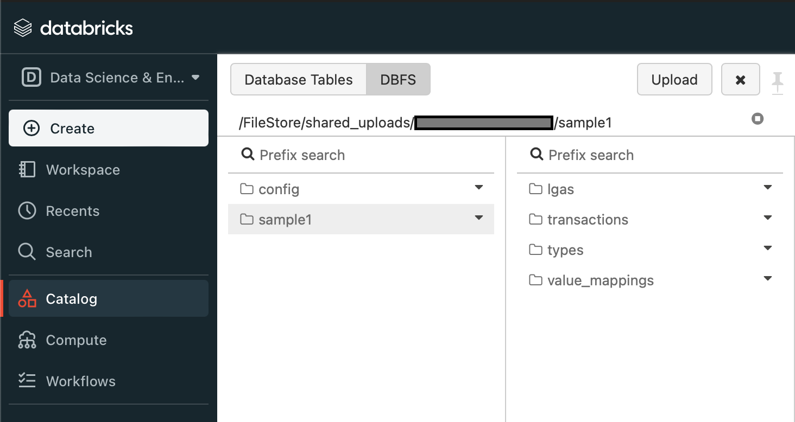

The first step is to set up some basics. Here we need to set up JSON5 so we can read the configuration.

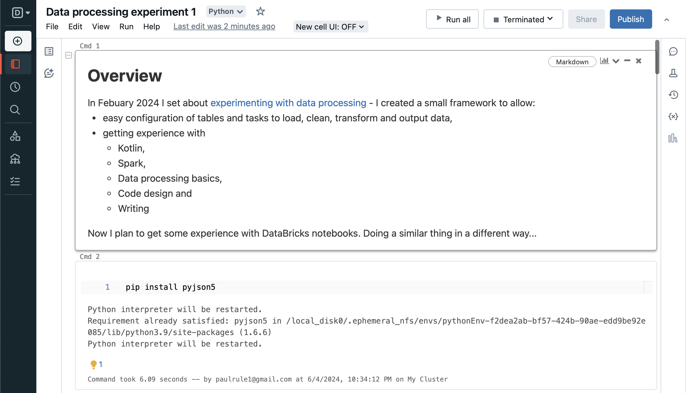

Now, set up some utility functions, and its important to know what version of python is available - here it's version 3.9.5.

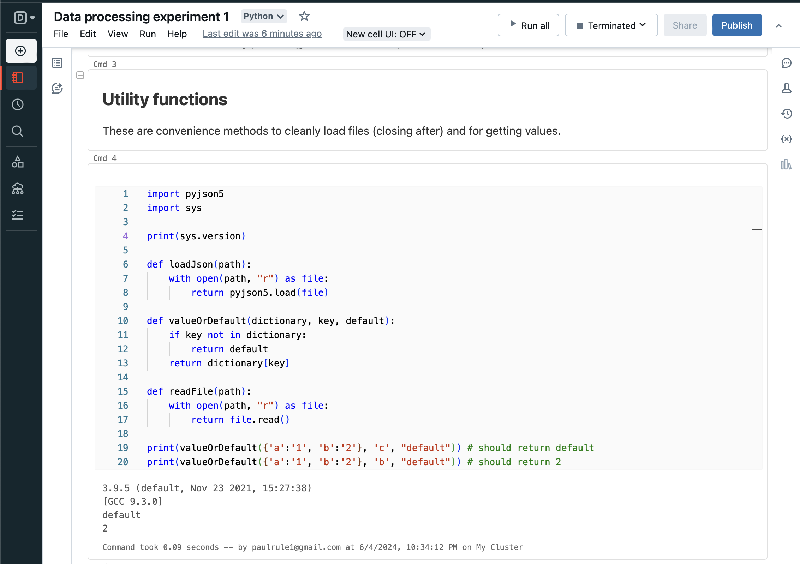

Copy the configuration from DBFS to local file so it can be read via python file system.

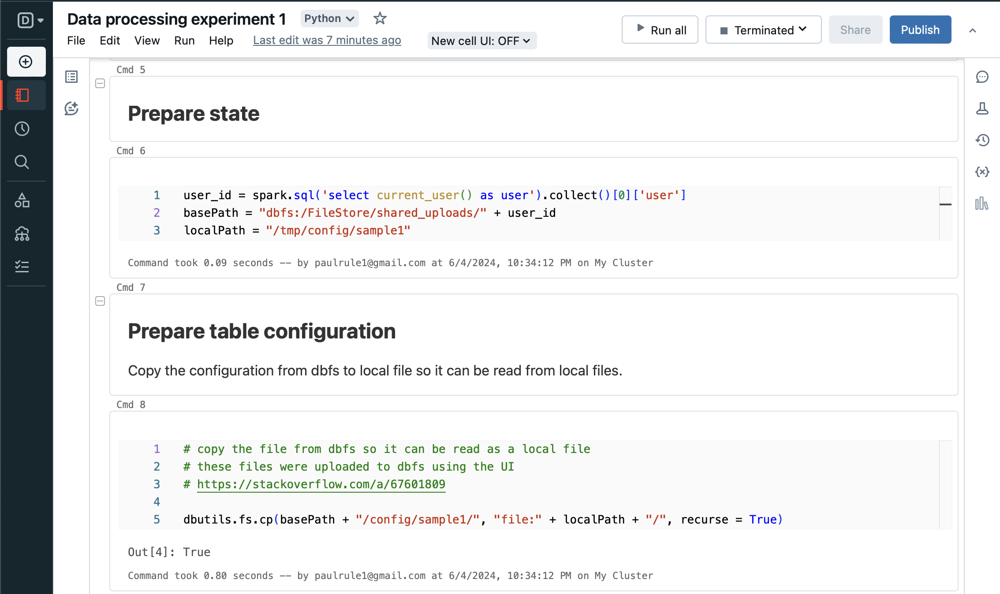

Load the configuration and print it out for reference.

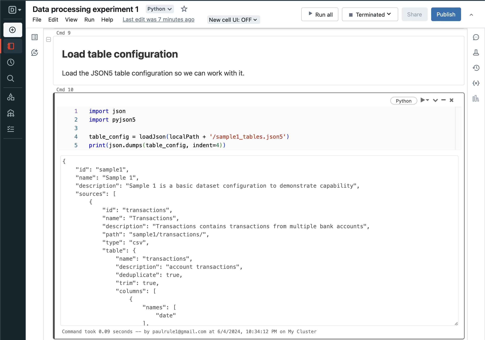

Loop over each table defined in the configuration and load into a dataframe - Spark can load from DBFS. Then add the dataframe to the context.

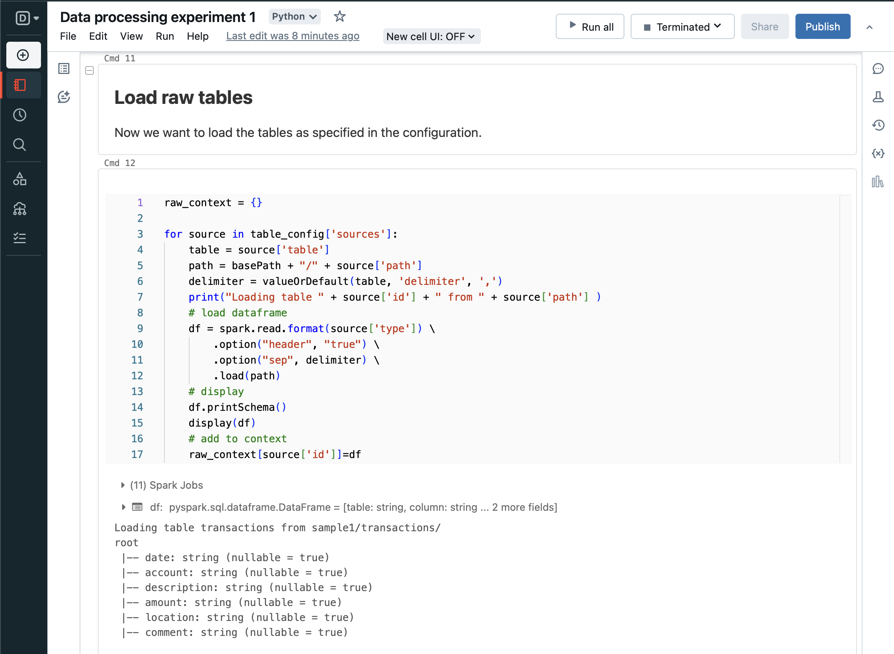

And display the dataframes as each one is loaded.

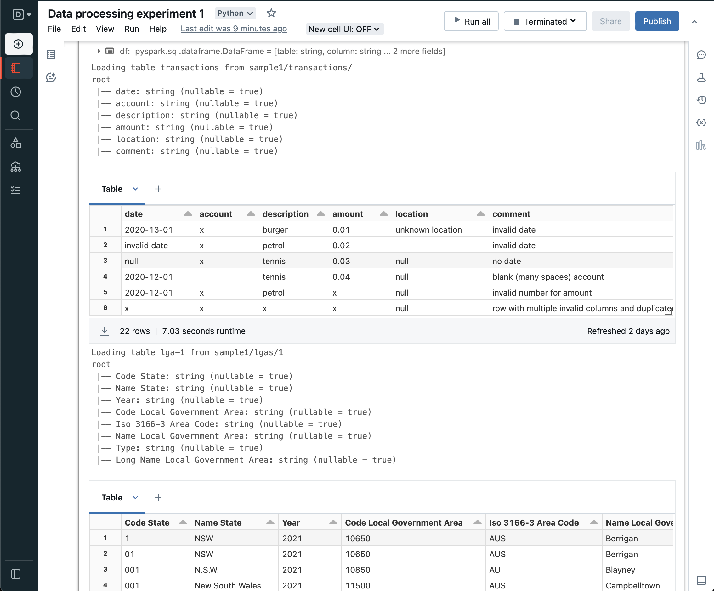

Next, loop over each table in the configuration again, selecting only the defined columns and aliasing so we end up with a standard dataframe.

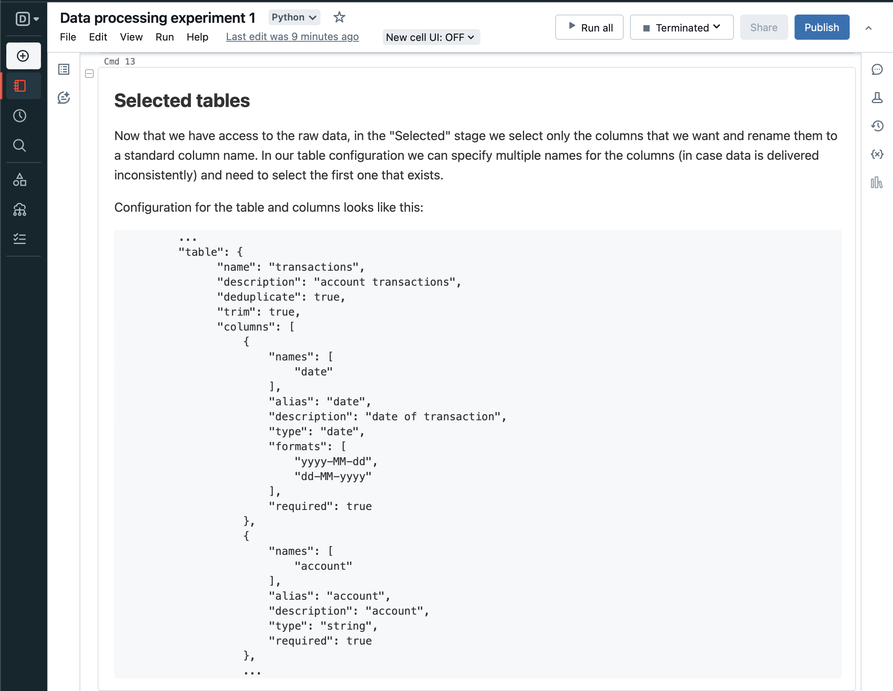
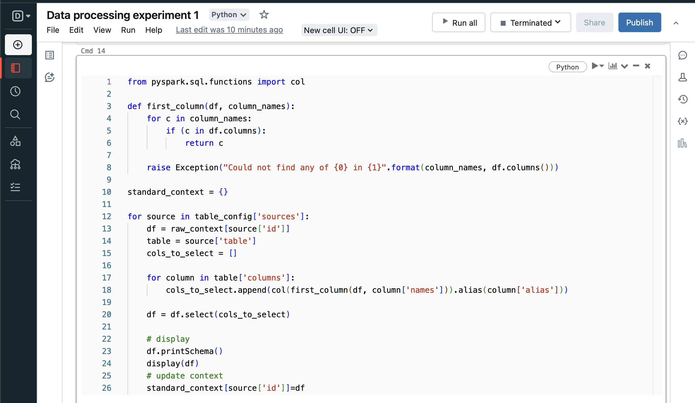
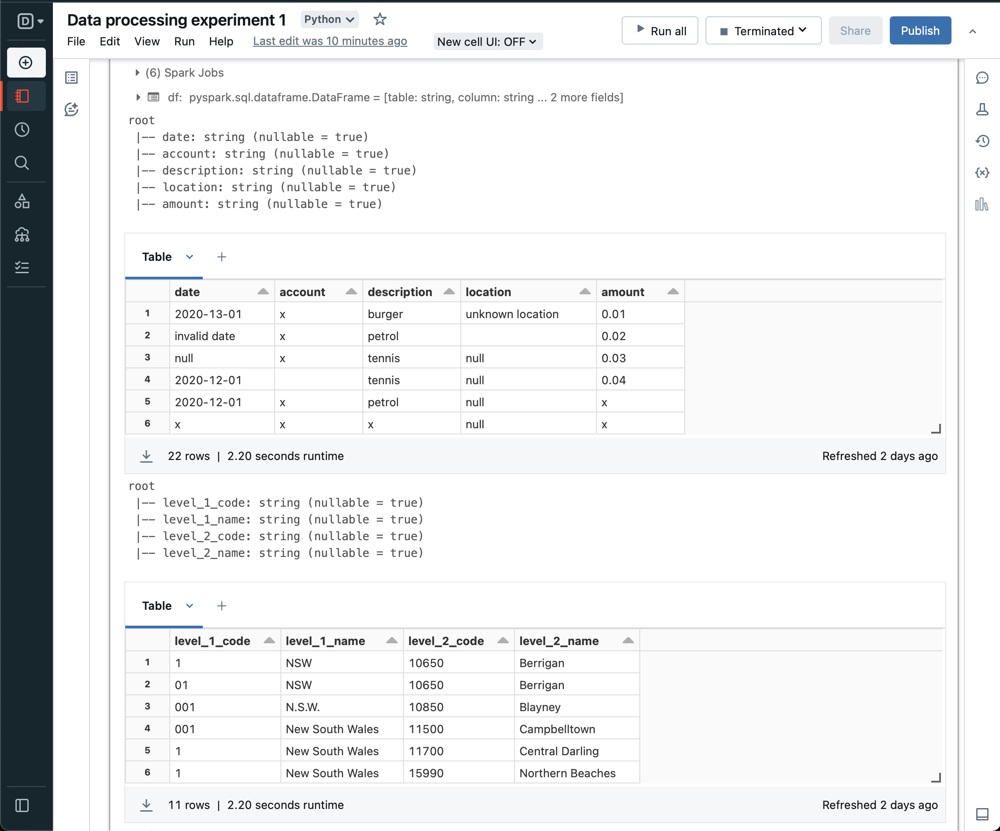

Similarly, convert the tables from all string columns to typed columns as per configuration. And update the context.


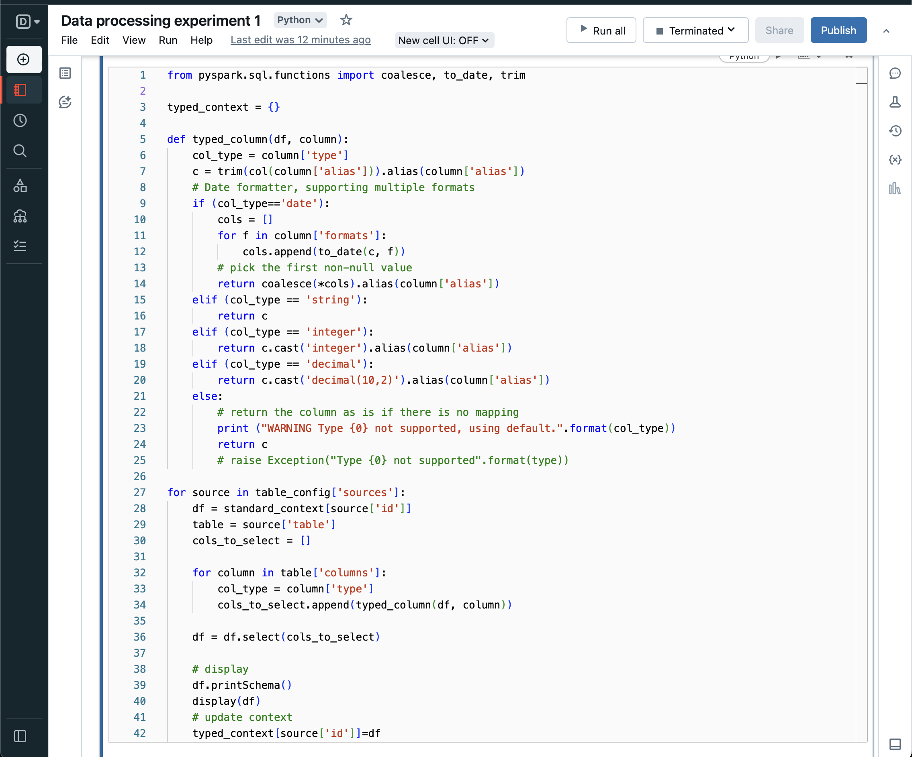
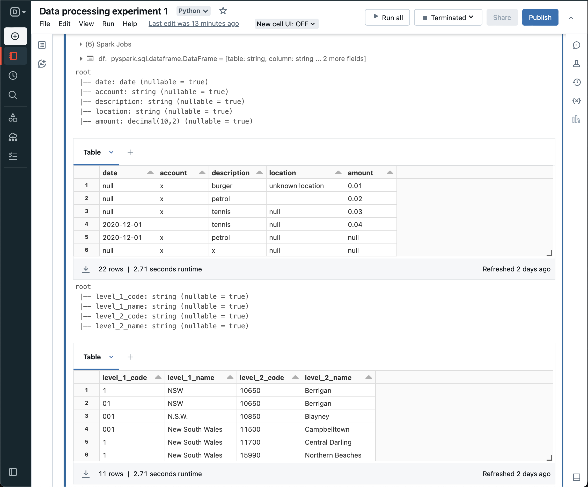

#### Summary

Here, I've gone from loading raw data using configuration to a typed dataset in a DataBricks notebook. There is still much to do to get it to parity with the functionality of the Kotlin codebase, but using python without any Object Oriented design wouldn't be satisfying so I'm going to leave it here, and try a different approach later.